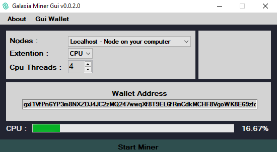

## GLX-GUI-MINER 0.0.2.1 for Windows
### Bear in mind this is Pre-release
* .NET Framework updated to 3.5 

* Download Link https://github.com/tieandsuit/gxi-GUI-miner/releases/tag/0.0.2.1
## GLX-GUI-MINER 0.0.2.0 for Windows
### Bear in mind this is Pre-release
* Progress bar for CPU usage
* Rearrange GUI
* Source Code for 0.0.2.0 released

* Download Link https://github.com/tieandsuit/gxi-GUI-miner/releases/tag/0.0.2.0
## GLX-GUI-MINER 0.0.1.8 for Windows
* fixed error in naming coin ;)
* small bug fix
* Download Link https://github.com/tieandsuit/gxi-GUI-miner/releases/tag/0.0.1.8
## GXI-GUI-MINER 0.0.1.6 for Windows
* Added some links of interest 
* Rearranged GUI
* Code optimization
* Download Link https://github.com/tieandsuit/gxi-GUI-miner/releases/tag/0.0.1.6
## GXI-GUI-MINER 0.0.1.4 for Windows
* Download Link https://github.com/tieandsuit/gxi-GUI-miner/releases/tag/0.0.1.4
### Donations are welcome :) 
gxi1VfPn6YP3m8NXZDJ4JC2zMQ247wwqXf8T9EL6fRmCdkMCHF8VgoWK8E69zfor2ND58obQMUNhoSRU71VKMeZ62Q1F8qHgSP
